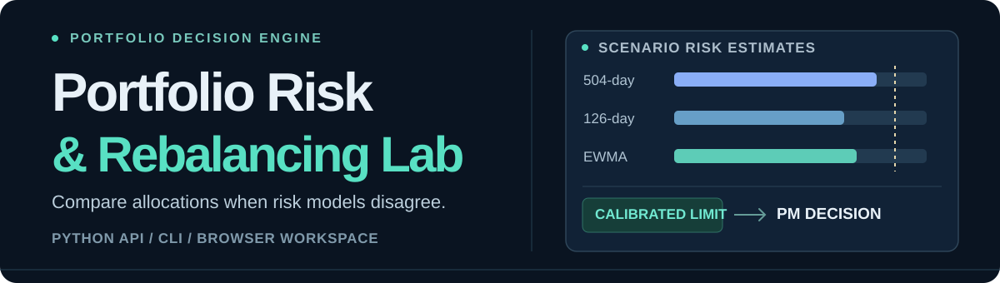
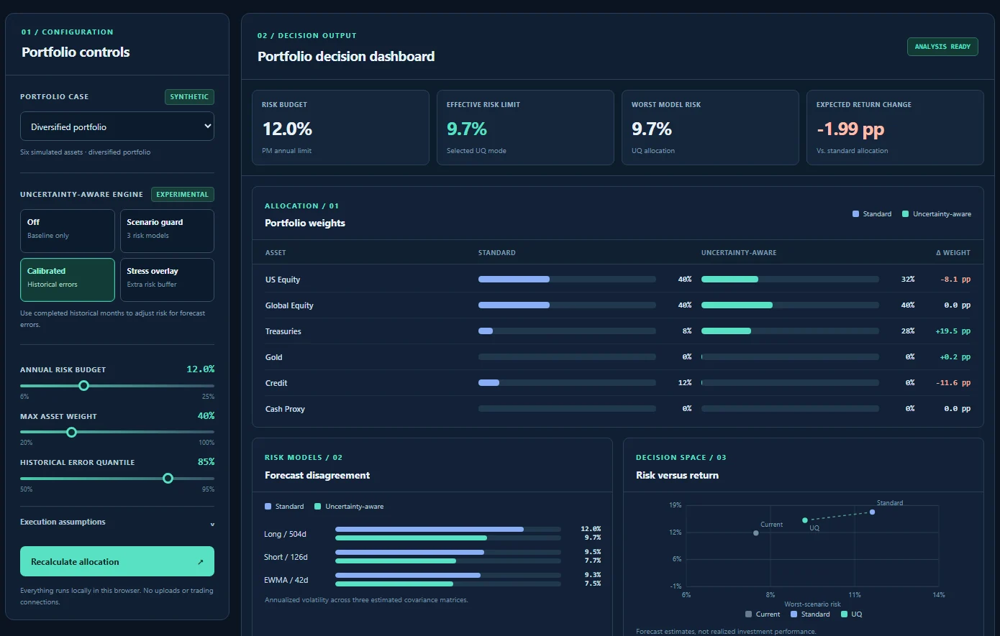

<p align="center">
  
</p>

<p align="center">
  <strong>Compare allocations when risk models disagree — and see what protection costs.</strong>
</p>

<p align="center">
  <a href="https://garroshub.github.io/Modern-Portfolio-Optimizer/">Interactive workspace</a>
  · <a href="#quick-start">Quick start</a>
  · <a href="#python-api">Python API</a>
  · <a href="#research-boundaries">Research boundaries</a>
</p>

<p align="center">
  
</p>

<p align="center"><sub>Real local interface screenshot. Data shown are synthetic, not historical ETF returns. Browser calculations approximate the full Python solver.</sub></p>

## What you can do

**Portfolio Risk & Rebalancing Lab** combines a general-purpose Python optimization toolkit with a serverless portfolio manager decision workspace. It shows how competing covariance forecasts and historical prediction errors affect weights, risk-budget feasibility, and the expected cost of protection.

| PM question | Decision output |
| --- | --- |
| Where do risk models disagree? | Long-window, short-window, and EWMA forecasts |
| What changes when uncertainty matters? | Standard versus uncertainty-aware weights |
| How conservative is the adjustment? | Historical error margin and effective risk limit |
| What is the cost of protection? | Expected-return difference, turnover, and estimated trading cost |

### Interactive workspace

The [browser demo](https://garroshub.github.io/Modern-Portfolio-Optimizer/) places the actual controls first. Choose among three **simulated** portfolio cases and four experimental decision modes:

| Mode | Portfolio decision rule |
| --- | --- |
| **Off** | Use the standard long-window covariance estimate |
| **Scenario guard** | Respect three simultaneous covariance risk forecasts |
| **Calibrated** | Apply a completed-month historical risk-error margin |
| **Stress overlay** | Add a user-selected extra risk buffer for sensitivity analysis |

Change the annual risk budget, maximum asset weight, historical error quantile, and trading-cost assumption. The display recalculates the portfolio weights, model disagreement, risk–return map, and opportunity-cost comparison.

> **Pages setup:** The repository owner must enable **GitHub Actions** in **Settings → Pages** before the Pages URL is active. The complete static website is also available in [`docs/`](./docs/).

## Quick start

Requires **Python 3.10+** with NumPy, pandas, and SciPy.

```bash
git clone https://github.com/garroshub/Modern-Portfolio-Optimizer.git
cd Modern-Portfolio-Optimizer
python -m pip install -e .

# Reproducible synthetic example
portfolio-risk-lab demo --output demo_report.json

# Analyze your own return series
portfolio-risk-lab compare \
  --returns daily_returns.csv \
  --cash-asset Cash_Proxy \
  --risk-budget 0.12 \
  --output decision_report.json
```

Your CSV should contain **daily simple decimal returns**, not prices: `0.01` means +1%. The default configuration needs at least 504 observations. Monthly historical calibration additionally needs a unique, ascending date index.

## Python API

```python
import pandas as pd
from portfolio_risk_lab import PortfolioAnalyzer, RiskConfig

returns = (
    pd.read_csv("daily_returns.csv", parse_dates=["date"])
    .set_index("date")
)

lab = PortfolioAnalyzer(
    returns=returns,
    current_weights=None,  # or an aligned mapping / Series / array
    config=RiskConfig(
        risk_budget=0.12,
        max_weight=0.40,
        cash_asset="Cash_Proxy",  # user-supplied tradable asset
        transaction_cost_bps=10,
        risk_calibration_quantile=0.85,
    ),
)

result = lab.compare(
    methods=["standard", "scenario_robust"],
    uncertainty="historical_calibration",  # or "none"
)

print(result.allocation_comparison)
print(result.scenario_volatilities)
print(result.risk_budget_analysis)
print(result.risk_contributions)
```

Optional asset-aligned **annualized** `expected_returns=` and `covariance=` inputs are supported. Custom covariance disables historical error calibration, because the custom forecast itself has not been evaluated by that procedure.

The Python optimizer is long-only and fully invested, with per-asset caps and hard volatility constraints. It raises errors for infeasible budgets. A configured `cash_asset` remains a **risky tradable asset** with observed returns, not risk-free cash.

## How it works

```text
Historical daily returns
     │
     ├── 504-day covariance ──────────────┐
     ├── 126-day covariance ──────────────┤──► Scenario risk constraints
     └── EWMA covariance ─────────────────┘               │
                                                         ▼
Completed-month forecast errors ──► Risk margin ──► Robust allocation
                                                         │
Standard allocation ─────────────────────────────────────┤
                                                         ▼
                                      Weights · Risk · Return · Trading cost
```

Calibration compares month-ahead realized volatility to risk-model forecasts on **predefined reference portfolios** using only fully completed historical months. Its multiplier can tighten the effective risk budget. The PM can then compare risk reduction with its estimated opportunity cost.

The static browser website uses a **feasibility-checked coordinate-search approximation**; the Python package uses **SciPy optimization**. They are separate implementations and may produce different allocations.

## Research boundaries

Uncertainty awareness is **experimental decision support**, not validated alpha or a formal statistical risk guarantee.

- Robust historical risk constraints sometimes reduced realized monthly volatility-limit violations.
- Simple risk-matched conservative limits often delivered **higher economic utility** than calibrated uncertainty rules.
- A nominal 85% historical error quantile did **not** reliably deliver 85% out-of-sample coverage across the exploratory ETF groups.
- The website uses **synthetic cases**; no interface places trades or connects to brokerage accounts.

Local experimental datasets, caches, and generated research files are excluded from this public package.

## Test and develop

```bash
python -m pytest -q -o addopts= tests_package
node --test tests_site/browser_engine.test.mjs
node --check docs/main.js

# Preview the static website
python -m http.server 8765 --directory docs

# Build a local wheel and source distribution
python -m build --no-isolation
```

The core Python library has no browser-server dependency. See the source in [`portfolio_risk_lab/`](./portfolio_risk_lab/) and the Pages deployment workflow in [`.github/workflows/pages.yml`](./.github/workflows/pages.yml).

<details>
<summary><strong>Attribution and release status</strong></summary>

The original Markowitz optimization and data-management code in `src/` credits **Marek Ozana (2024)**; the original attribution remains in place. The newer package and static decision workspace are separate implementations.

The `portfolio-risk-lab` package is **not published to PyPI**. Original-code reuse rights and the project license should be confirmed before an external package release.

This software supports research and decision analysis, not personalized investment advice.

</details>
